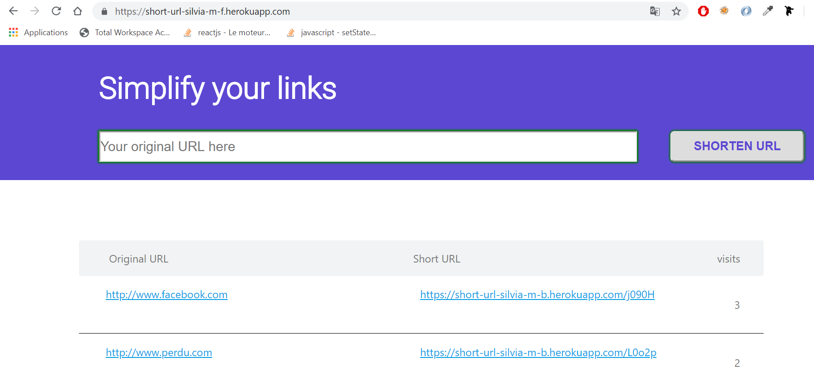

# shortUrl-Frontend

Frontend part of a custom shortUrl project  
Deployed on Heroku platform   

Find the accessible link here : [https://short-url-silvia-m-f.herokuapp.com](https://short-url-silvia-m-f.herokuapp.com)   

it allows to reduce a link, just paste the long URL and click the Shorten URL button.    
You can copy the shortened URL and share it on publications, mails, blogs, forums...

  

